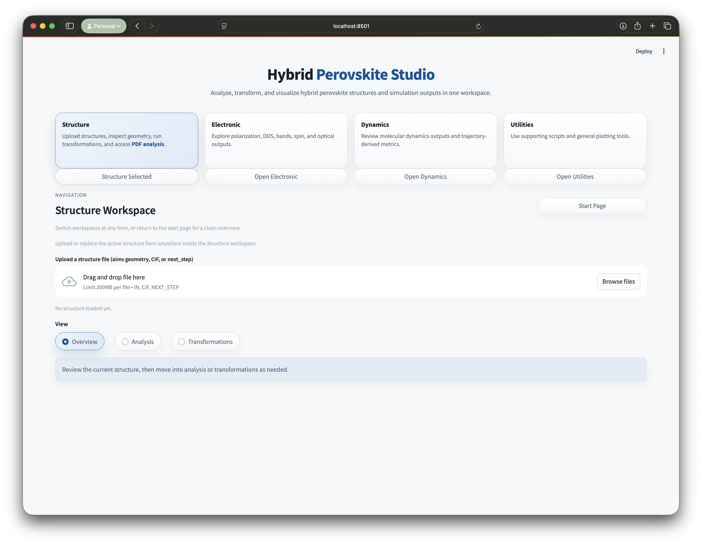
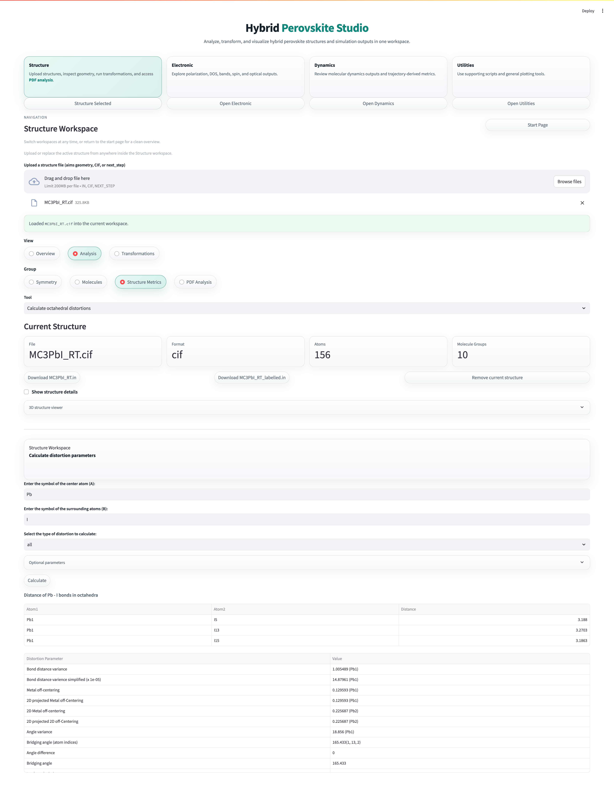
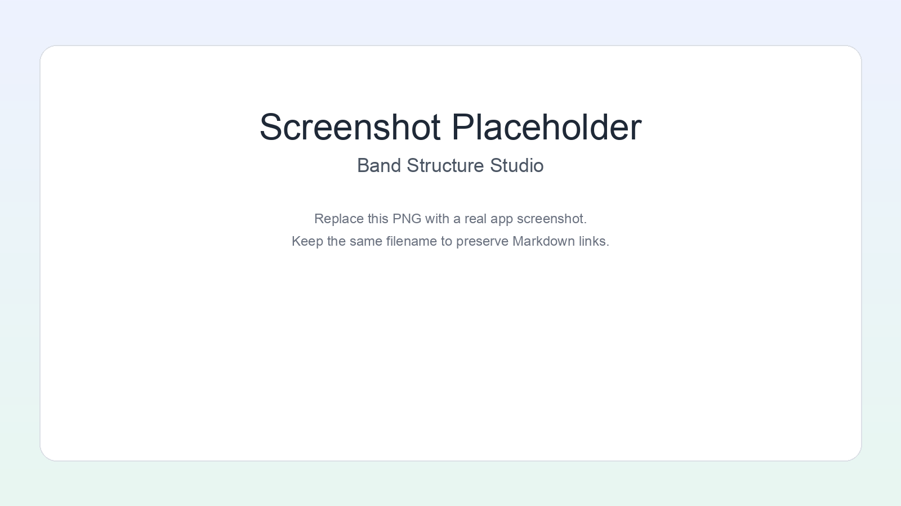
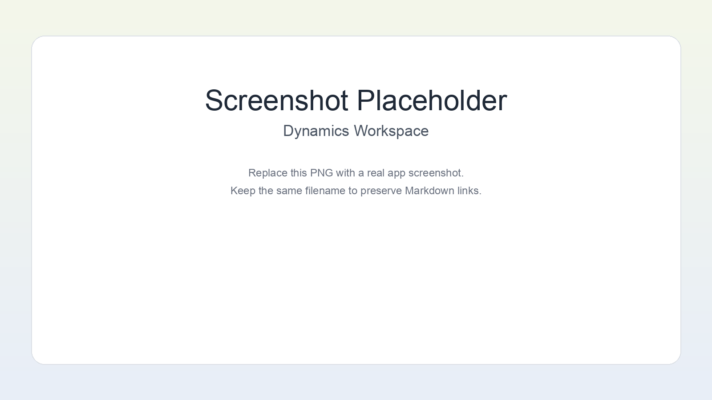

# Hybrid Perovskite Studio

Hybrid Perovskite Studio is a Streamlit app for structure analysis, transformations, electronic-output visualization, molecular-dynamics workflows, and utility tools for hybrid perovskite research.

## Run

```bash
python3 -m venv .venv
source .venv/bin/activate
pip install -e ".[full]"
streamlit run src/hps/app.py
```

## Docs

- [Getting Started](docs/user-guide/getting-started.md)
- [Feature Map](docs/feature-map.md)
- [Workspace Guides](docs/index.md)
- [Screenshots Guide](docs/user-guide/screenshots.md)

## Gallery









## Notes

- Main entrypoint: `streamlit run src/hps/app.py`
- Runtime files belong under `tmp/` and `output/`
- Navigation is defined in `src/hps/ui/navigation.py`
